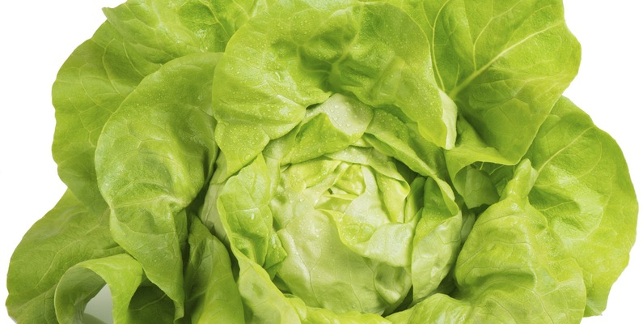

# Lettuce Growth Data Analysis

## Objective
Analyze the factors affecting lettuce growth and provide insights for optimizing growth conditions.

## Dataset
- **Source:** [Lettuce Growth Days Dataset on Kaggle](https://www.kaggle.com/datasets/jjayfabor/lettuce-growth-days)
- **File:** [lettuce_dataset.csv](../../datasets/lettuce_dataset_updated.csv)

## Tasks
### Data Cleaning Process
1. **Date Normalization**:
   - The original date column contained dates in inconsistent formats.
   - A formula was applied to normalize all dates to the `MM/DD/YYYY` format.
   - The normalized dates were copied back to the original date column to maintain consistency.
2. **Temperature Consistency Check**:
   -  Verified if the Celsius and Fahrenheit temperatures match. The formula used: `=IF(ROUND((C2*9/5+32),2)=ROUND(H2,2), "Match", "Check")`.

### Exploratory Data Analysis (EDA)

- **Summary Statistics**:
  - Mean Temperature: `=AVERAGE('lettuce_dataset_cleaned.csv'!C2:C)`
  - Median Humidity: `=MEDIAN('lettuce_dataset_cleaned.csv'!E2:E)`
  - Min/Max pH Level: `=MIN('lettuce_dataset_cleaned.csv'!F2:F)` / `=MAX('lettuce_dataset_cleaned.csv'!F2:F)`
  - Standard Deviation Temp: `=STDEV(lettuce_dataset_cleaned.csv!C2:C)`
  - Variance Humidity: `=VAR('lettuce_dataset_cleaned.csv'!D2:D)`
  - Corr (Temp, Growth Days):	 `=CORREL('lettuce_dataset_cleaned.csv'!C2:C, 'lettuce_dataset_cleaned.csv'!G2:G)`
- **Visualizations**:
  - Scatter Plot of Growth Days vs Temperature (°C)
    - .png)
  - Histogram of Humidity (%)
    - .png)

### Feature Engineering

- New features were created to enhance the dataset, such as `Average Growth` and `Growth Change`.

### Statistical Analysis

- Correlation analysis was conducted to identify relationships between variables.
- Hypothesis testing was performed to validate assumptions about the data.

### Visualization and Reporting

- Interactive dashboards were created to present key insights.
- A final report summarizing the analysis, findings, and recommendations was prepared.

## Analysis Files
- **Data Cleaning:** [lettuce_data_cleaning.xlsx](lettuce_data_cleaning.xlsx)
- **Exploratory Analysis:** [lettuce_exploratory_analysis.xlsx](lettuce_exploratory_analysis.xlsx)
- **Visualizations:** [lettuce_visualizations.xlsx](lettuce_visualizations.xlsx)

## Results
- [Lettuce Growth Analysis Report](../../reports/lettuce_analysis_report.pdf)

## Visuals

## Detailed Description
This project involves analyzing the lettuce growth dataset to understand the impact of various factors such as temperature, humidity, and pH levels on the growth of lettuce. The analysis includes data cleaning, exploratory data analysis, and visualization of the key findings.

